The focus in this blog is on validation, as well as being able to return the same output as we got the input. Which is a json format. As an example, when parsing an IP address as a string, the output value should be a string again and not an ipaddress object. Or the MAC address which needs to retain a certain format.

The "bonus" of also dumping it back into json, is that a diff can be done between the original and the output to see if anything was changed or missed.

This is based on a series that I did on [LinkedIn](https://www.linkedin.com/in/bartdorlandt/).

<!--more-->

## Basics first

Let's start with some basics.

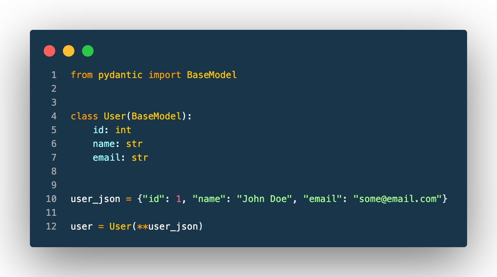

A print on 'user' and 'user.name' shows:

    "id=1 name='John Doe' email='some@email.com'"
    and
    "John Doe"

The same can be done with a user list and therefore using nested classes. See the 2nd screenshot

The output of "user" becomes:

    "users=[User(id=1, name='John Doe', email='some@email.com'), User(id=2, name='Jane Foo', email='jane@foo.com')]"

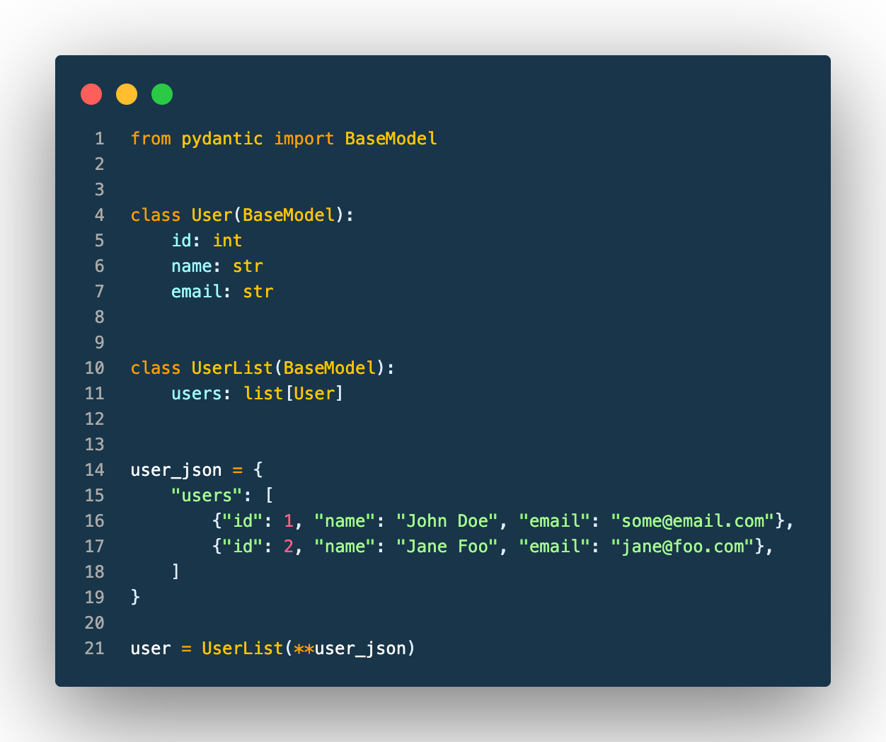


[Basics code on Github](https://github.com/bartdorlandt/pydantic_series_linkedin/tree/main/01_basics)

## Stricter validation

Here I'm coming from the angle that strict validation is better. It should fail sooner than later on possible wrong values.

Validation is done on a positive integer for the ID, the name string should not be empty and the email, should be.... a valid email of course. We will use the pydantic library to achieve this.

If you already had pydantic installed, it might still complain about the email portion. Add it using uv `uv add pydantic[email]` or by `pip install pydantic[email]`.

Looking at the first code the result is also shown. The happy flow is the easiest. But what if we "mess up"...

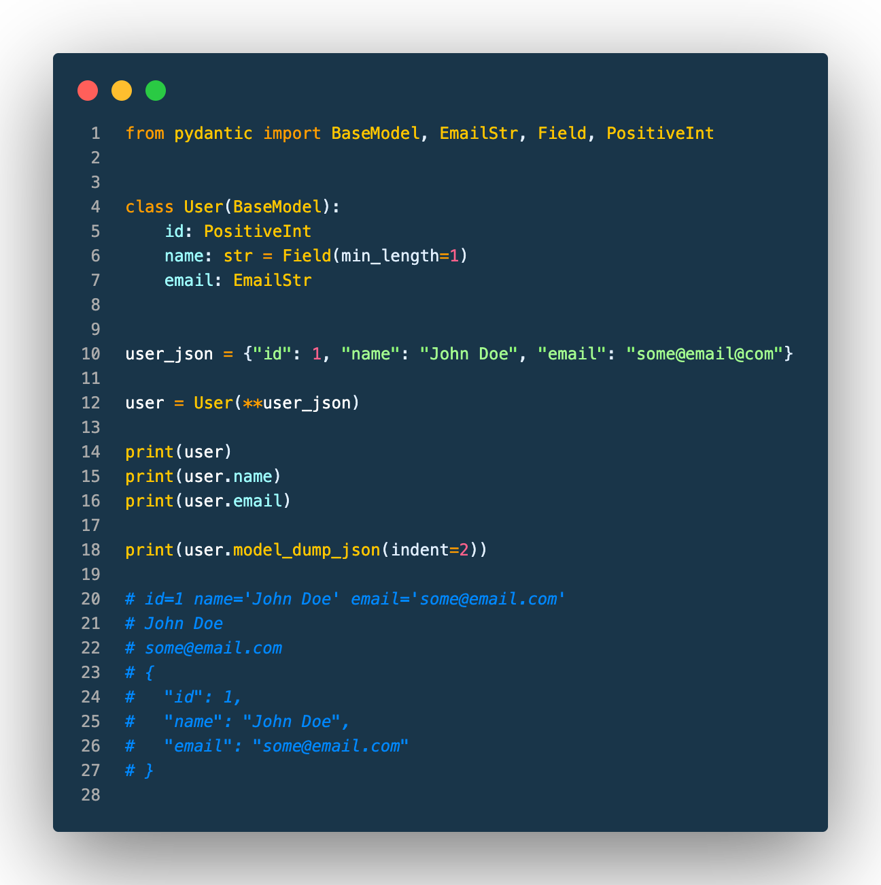

It will show a traceback on the wrong data, in this case the email address.

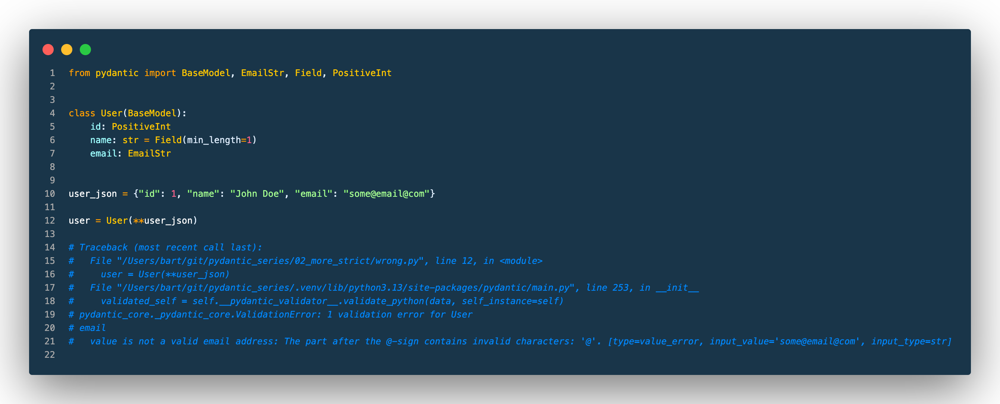

A wrong ID (negative) is also shown.

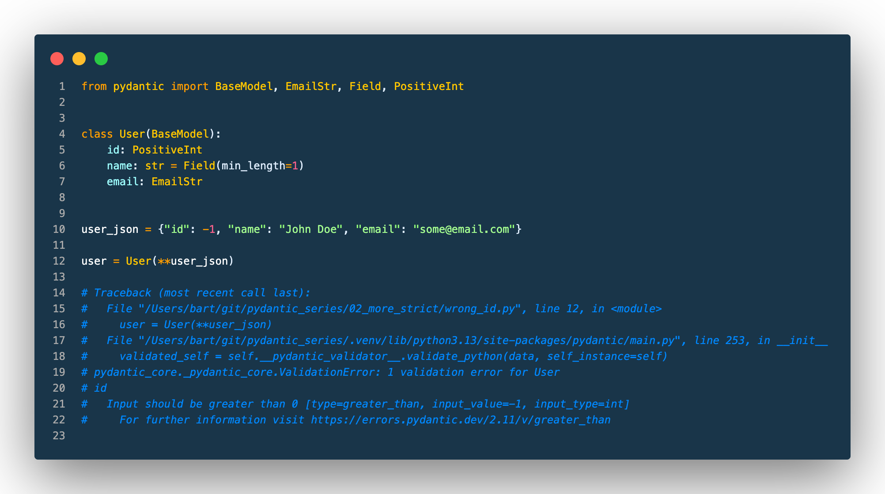

But... What if the ID is not a integer, will it fail? It actually doesn't, pydantic will tolerate this and will try to parse this string as an int, because that is what we told it to do.
This is great, because that is what you wanted, right?

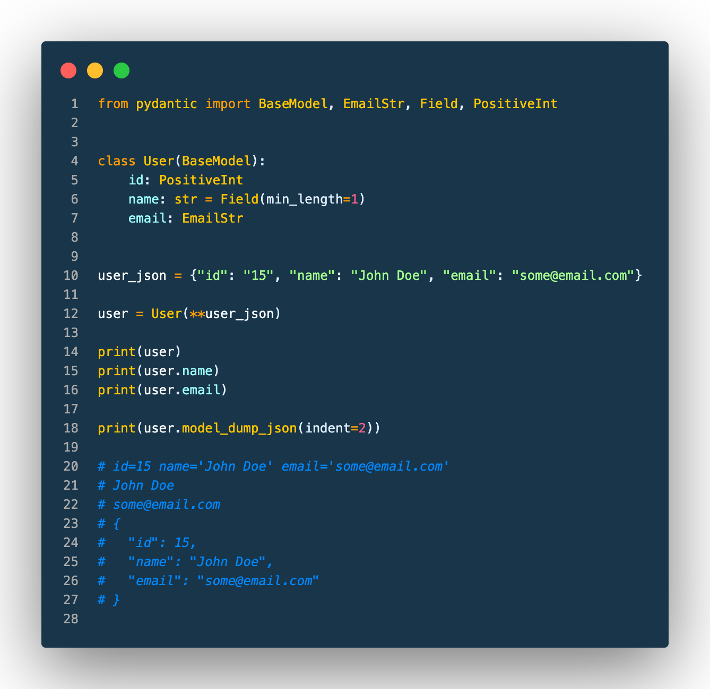

Though, it is not that great when you actually need to convert it back to its original state, meaning you want the validation but not actually changing the data because this model should work both ways.

This is what will be covered in the next chapter.

[Stricter code on Github](https://github.com/bartdorlandt/pydantic_series_linkedin/tree/main/02_more_strict)


## Additional validation

This chapter will handle some custom fields, being specific using "Literal", but also dealing with "Optional" fields.

All of this still needs to be able to convert back in the same way it was written. Because of this I'll also introduce the "deepdiff" library. Allowing me to compare the in and output, to validate them. This also allows me to capture any field that I could've missed, which would not show up in the output.

Let's start of with some pieces. Instead of using a PositiveInt as we did last time. We use a Annotated object, it will take an int and we still check for its value to be > 1. It gives me the option to add a Serializer allowing me to take actions when dumping it back into a json.

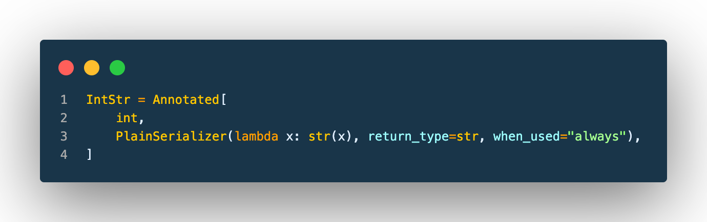

Annotated is from typing, PlainSerializer is from the #pydantic library.

```Python
IntStr = Annotated[int, PlainSerializer()]
```

In the example, we wish to parse a mac address. it is given in the format: "00:1A:2B:3C:4D:5E". We can use the `netaddr` library and use the EUI class, though this will convert it to "00-1A-2B-3C-4D-5E". This would be a problem when converting it back to a json.

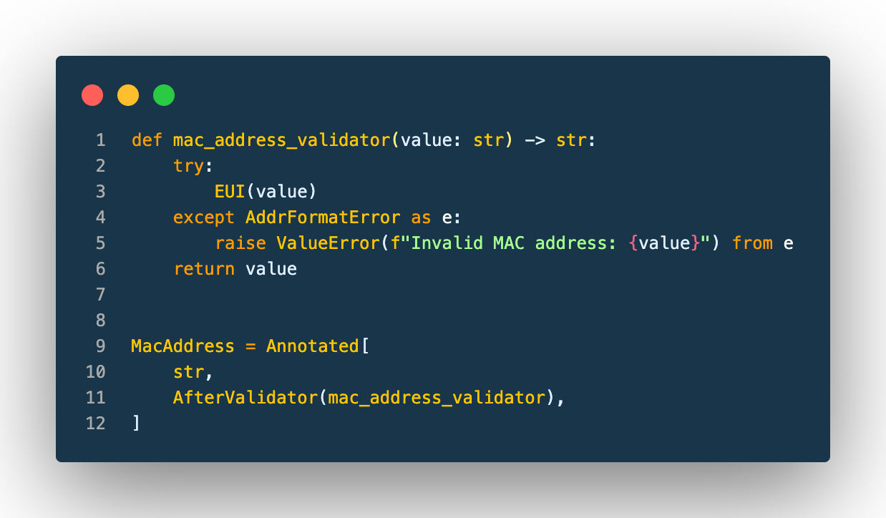


Let's create another Annotated object, which will do the validation, but not change the format on how it is stored.

```Python
MacAddress = Annotated[
    str,
    AfterValidator(mac_address_validator),
]
```

The type of the value is consider a string and we use the AfterValidator to ensure the format is as expected, but not storing its original value.

Have a look at the full code and its output.

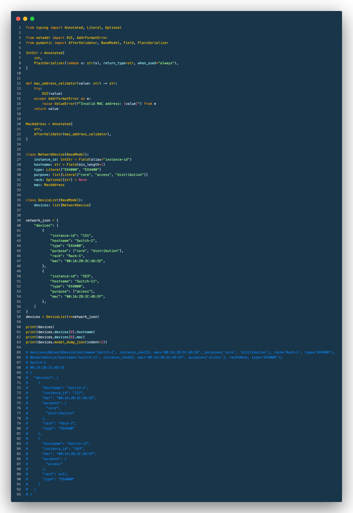


Next to the two snippets shown above, we also introduced Literal, which takes exact values which should be match. If it ain't defined, it ain't accepted.
The Optional is seen on the rack. Where the key may be omitted, though if provided it should be a string. If absent, the default value is None.

Comparing the 2 objects by hand doesn't sound like fun. Introducing deepdiff to compare 2 objects, as well as rich.print to improve readability . (2nd screenshot)

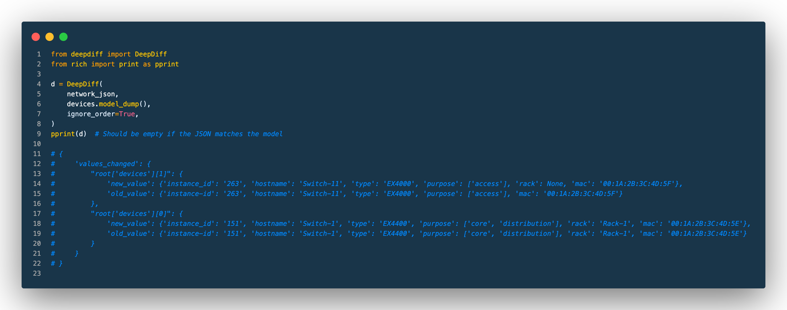

Given the code from the first screenshot, we still have issues. The most tricky one to see is the "instance-id" key, which got changed to "instance_id". See:

```Python
instance_id: IntStr = Field(alias="instance-id")
```

the reading parsing went fine, dumping the model not so much. Easy fix:

`devices.model_dump(by_alias=True)`

> same would apply for devices.model_dump_json(by_alias=True)

The other entry in the list has the "rack" key defined, because we gave it a default value "None". This is not what I want, so also adding `exclude_none=True` to the dump.

We now have a repeatable test , which can also validate if fields would've been added to the json, but not in the model.

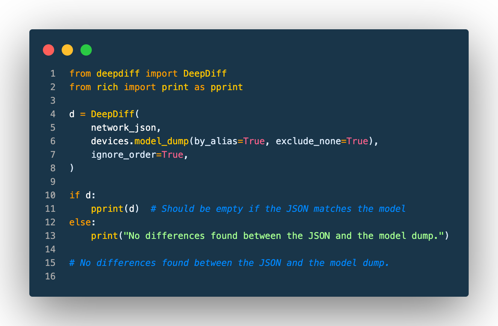

A perfect validation in your pipeline...

[Annotations code on Github](https://github.com/bartdorlandt/pydantic_series_linkedin/tree/main/03_annotations)

## A bit of regex

The last time I showed a custom AfterValidator for validating a MacAddress. Let's have a look at a port validator as well. This specific solution is meant for a `Juniper` device.

It is expected a string and it shouldn't be empty, furthermore it should comply with the provided regex. This validator doesn't affect how the value is stored, its sole purpose is to validate the input matching a port.

The following values are matching entries:

    et-0/0/0
    ge-0/0/1:1
    ge-1/0/1:15
    xe-2/2/2


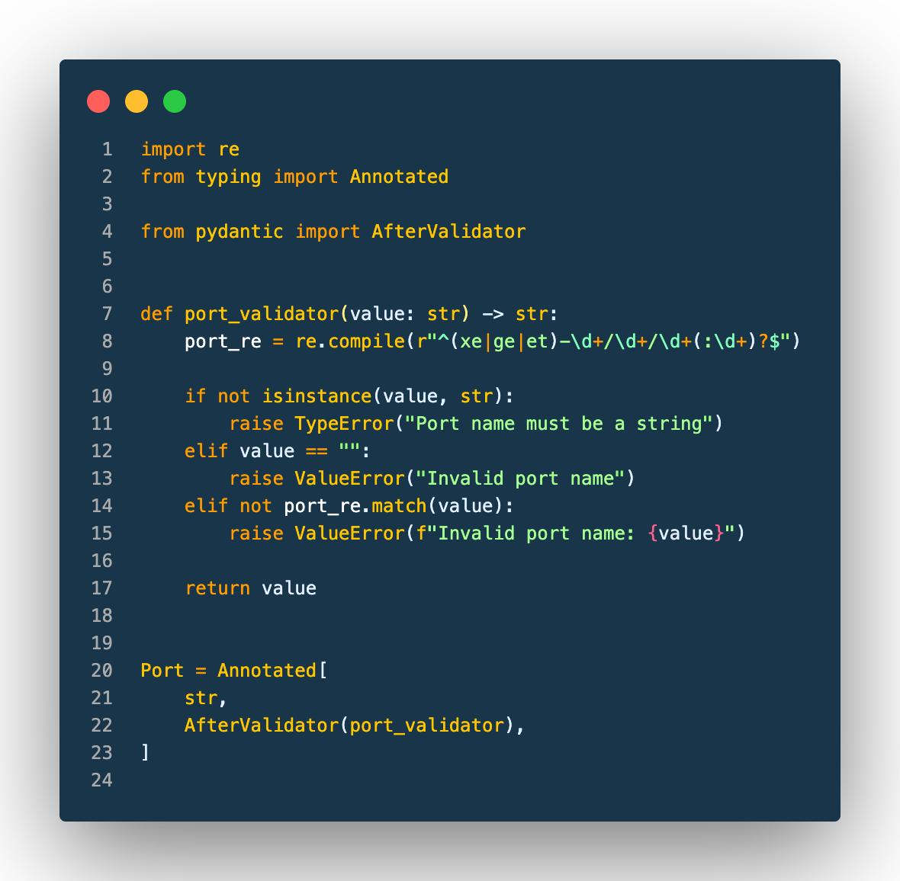

[Regex code on Github](https://github.com/bartdorlandt/pydantic_series_linkedin/tree/main/04_some_regex)


## Union
This chapter deals with values that could be different types. On its own it is not that hard, especially using a newer #python version.

The code and output show the use of multiple value types used. "role" could be a string or a list of strings.

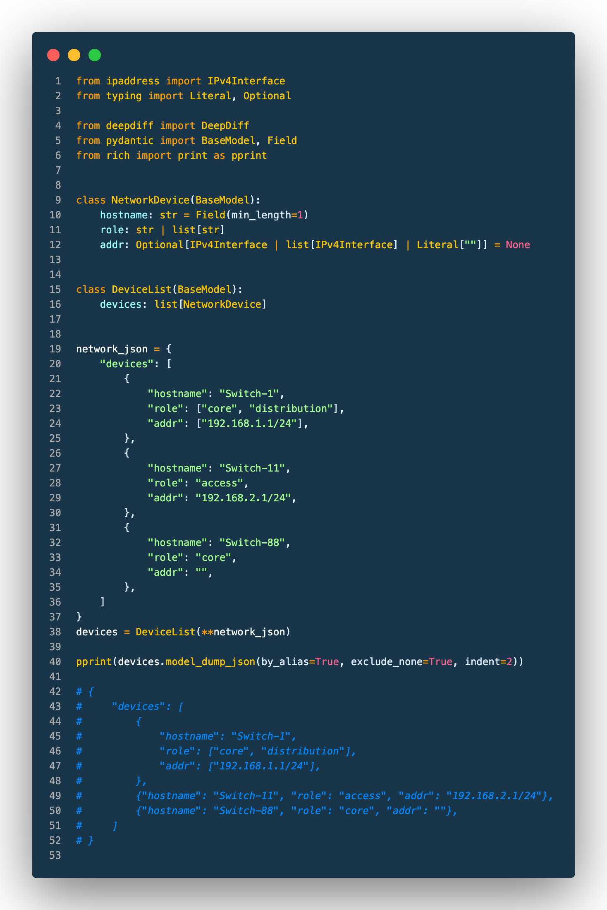

While "addr" is an optional field, which can be a IPv4Interface or a list of them, or a literal empty string. It is not ideal, but being able to deal with this type of things is a real world example.

This is using the "smart mode" of [Unions](https://docs.pydantic.dev/latest/concepts/unions/).

NOTE:

> Here is a heads up in case you were trying to do the same trick, but then using "ip_interface", which could handle IPv4Interface and IPv6Interface and return the correct type....
> It doesn't work.

Changing the addr line: `addr: Optional[ip_interface | list[IPv4Interface] | Literal[""]] = None `

And running it gives:

```python
Traceback (most recent call last):
  File "/Users/bart/git/pydantic_series/05_double_typed_data/01_double_typed.py", line 9, in <module>
    class NetworkDevice(BaseModel):
    ...<3 lines>...
        addr: Optional[ip_interface | list[IPv4Interface] | Literal[""]] = None
  File "/Users/bart/git/pydantic_series/05_double_typed_data/01_double_typed.py", line 13, in NetworkDevice
    addr: Optional[ip_interface | list[IPv4Interface] | Literal[""]] = None
                   ~~~~~~~~~~~~~^~~~~~~~~~~~~~~~~~~~~
TypeError: unsupported operand type(s) for |: 'function' and 'types.GenericAlias'
```

This is due to it being a `function`, not a `Type`.


### Option 2

An alternative is using the "IPvAnyInterface" from pydantic instead.

```python
addr: Optional[IPvAnyInterface | list[IPvAnyInterface] | Literal[""]] = None
```

This works great for validation, though when writing back a json, the type is still present:

```python
"addr": "[IPv4Interface('192.168.1.1/24')]"
```

We could solve all of this with the `serialiser`, or we stick to the specific types. Choices, choices...

For the deepdiff check, even with the initial method, we will change it to using a dump to json and then reading the json back into a python object. This will eliminate the types that would otherwise conflict. As an example:

```python
    'values_changed': }
```

See the second screenshot with the end result being the same as the input. Mission accomplished.

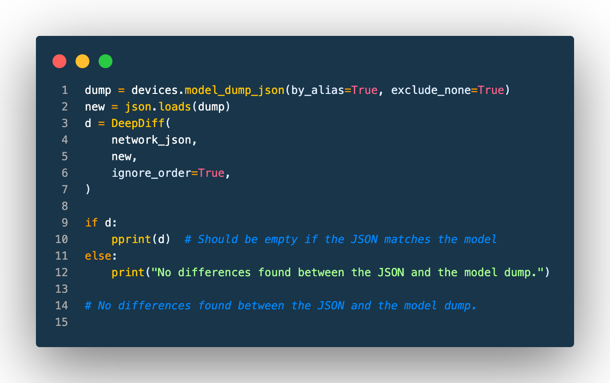

I do realize that my additional request to be able to write the json the same as it was can be a challenging requirement and most that read this, might have a simpler use case, which just uses validation. If so, make your life easier by simplifying it all.

Though for those that are in some sort of migration that needs to go both ways, this might be the trick you were looking for. This also allows for validation if all the data is actually modeled. If any field is missing in pydantic, it will present a diff in the result.

[Double typed data code on Github](https://github.com/bartdorlandt/pydantic_series_linkedin/tree/main/05_double_typed_data)


## Dynamic dictionary

In the previous examples the structure was easily matched on the model and something can be said about that. If you can influence that, make it so! Your future self will thank you.

In this example, the keys are "dynamic" in the way, we can't predict them.
Instead of using the pydantic `BaseModel`, we'll use the `RootModel` to match this.

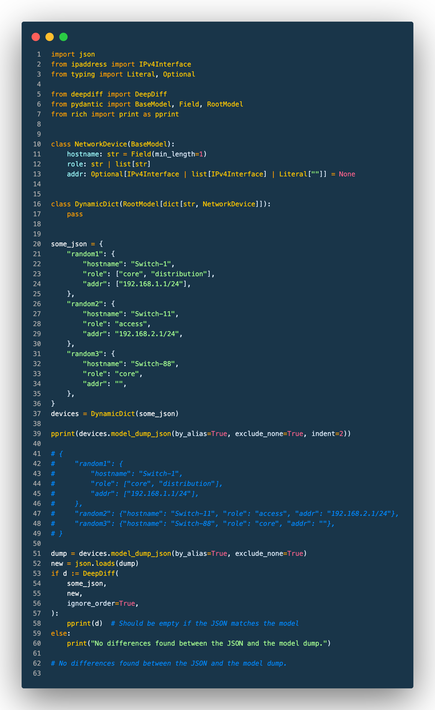


The trick is in the `DynamicDict` class, with the `RootModel` defined.

```python
class DynamicDict(RootModel[dict[str, NetworkDevice]]):
    pass
```

The `NetworkDevice` is the same as in previous example.


But.... Could it deal with this kind of dynamic nature, when the inner dictionary is also dynamic (read: different) per key.

This is the part where I saw some real power of pydantic. I expected this would've led to some complicated code. Turns out, it is just one (smart) Union away. See screenshot 2.

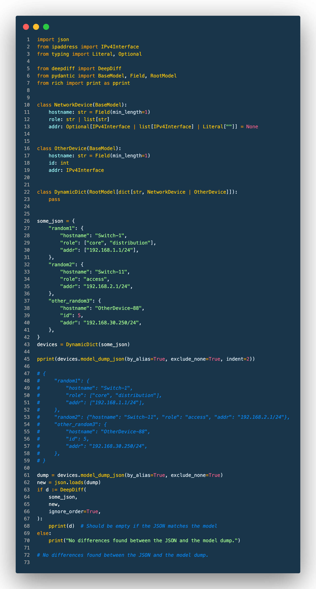

We "just" created another model (`OtherDevice`) and added it to the `DynamicDict` class.

```python
class DynamicDict(RootModel[dict[str, NetworkDevice | OtherDevice]]):
```

Man, I love this smart Union mode.

[Dict root code on Github](https://github.com/bartdorlandt/pydantic_series_linkedin/tree/main/06_dict_root)


## Own validator

There are limits...

In the previous post, I showed the power of [smart Union](https://docs.pydantic.dev/latest/concepts/unions/#smart-mode). But if your data is complex enough, the Union might get confused. The following example will show what I'm hinting at, though this example will not crash on making it a union.

It is still meant as an alternative for those "rare" (daily average production) occasions.

This example (man I do hope you have a tall monitor) has some inheritance to simplify some models and the main part which is:

```python
NETWORK_DEVICE_REGISTRY =


class NetworkDeviceDict(dict[str, BaseModel]):
    @classmethod
    def __get_validators__(cls) -> Iterator:
        yield cls.validate

    @classmethod
    def validate(cls, value: dict[str, dict], info=None) -> "NetworkDeviceDict":
        if not isinstance(value, dict):
            raise TypeError("devices must be a dict")
        result =
        for key, val in value.items():
            if key.startswith("rtr"):
                key_name = "rtr"
            elif key.startswith("switch"):
                key_name = "switch"
            elif key.startswith("console"):
                key_name = "console"
            else:
                raise ValueError(f"key '' not lookup logic for devices")
            model_class = NETWORK_DEVICE_REGISTRY.get(key_name)
            if not model_class:
                raise ValueError(f"key '' not in NETWORK_DEVICE_REGISTRY")
            try:
                result[key] = model_class(**val)
            except ValidationError as e:
                pprint(f"Validation error for : ")
        return cls(result)
```

With its own `validator` it allows you to specifically select which model to assign to which key. This would be particularly useful for complex data structures where you might want to select on something deeper down the tree. Or just providing the different type of models based on the key, as shown in this example.

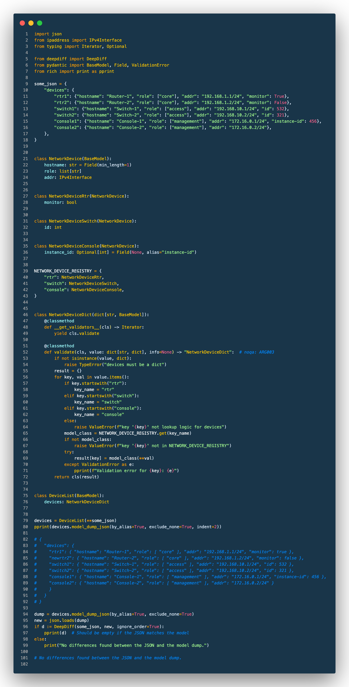


[Own validator code on Github](https://github.com/bartdorlandt/pydantic_series_linkedin/tree/main/07_own_validator)


## Before validator

In a chat, [Urs Baumann](https://www.linkedin.com/in/ubaumannch/) pointed out to be annoyed by inputs that could have 2 values, like strings and list of strings. To store those consistently as list[str] inside your pydantic model, the BeforeValidator() can be used. This will manipulate your data into its consistent desired type.

I hadn't written about it before, because my specific use case required data to be restored as it was, therefore I was using a Union of "str | list[str]". The output below shows that the BeforeValidator makes things consistent, therefore it can't be restored to its original type (str).

Treat this as a different use case, ensuring consistency.

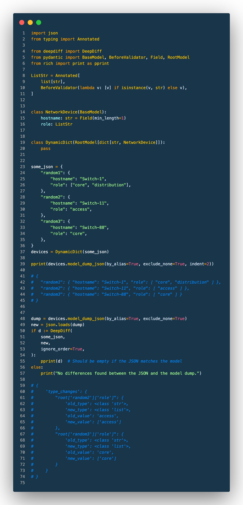


The diff for the return path is beautifully shown by the deepdiff output.

```python
,
        "root['random3']['role']":
    }
}
```

[BeforeValidator code on Github](https://github.com/bartdorlandt/pydantic_series_linkedin/blob/main//08_before_validator/01_before.py)

## Conclusion

In this long post, we explored the use of Pydantic to validate complex data structures, including the use of custom validators and the BeforeValidator to ensure consistent data types. By leveraging these features, we can create more robust and maintainable data models.

By having this data verified upfront, we can catch potential issues early in the process, leading to a simpler and more efficient code focussing on the business logic.

Do note that this specific use case of being able to dump the data in exactly the same format as it was received is usually not required and simplifies the overall data handling process.
